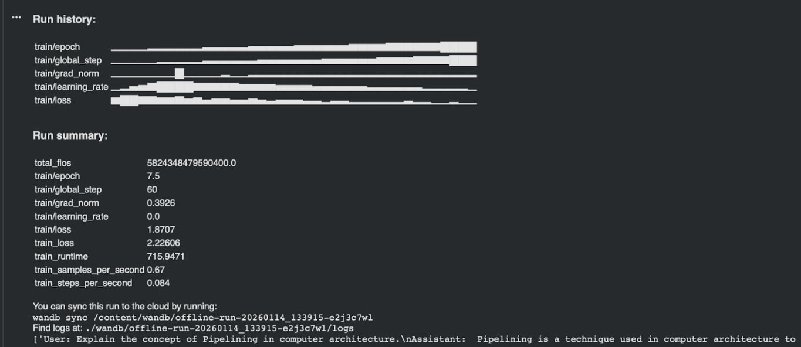

# SLM - Small Language Model RAG Project

This project implements a Retrieval-Augmented Generation (RAG) system using a Small Language Model (SLM), specifically targeting the "Computer Architecture: A Quantitative Approach" textbook. It includes pipelines for data processing, RAG implementation, and model fine-tuning.

## Project Structure & File Descriptions

### 1. Data Processing
*   **`separate_chps.py`**: 
    *   **Purpose**: Splits the raw PDF textbook (`book.pdf`) into 6 distinct chapters.
    *   **Functionality**: 
        *   Extracts text from the PDF.
        *   Ignores exercises at the end of each chapter to focus on core content.
        *   Uses `clean_text.py` to sanitize the extracted text.
        *   Outputs 3 files for each chapter into the `chapters_db/` folder:
            1.  `index.faiss`: The vector database index for fast similarity search.
            2.  `texts.pkl`: The actual text chunks corresponding to the vectors.
            3.  `meta.pkl`: Metadata for the chunks.

*   **`clean_text.py`**:
    *   **Purpose**: A utility module for text cleaning.
    *   **Functionality**: Contains regex-based functions to fix common PDF extraction errors (e.g., broken words like "fi le" -> "file", hyphenated line breaks), remove garbage characters, and strip out headers/footers/references.

### 2. RAG & Inference
*   **`retriever.py`**:
    *   **Purpose**: Implements the core RAG logic.
    *   **Functionality**:
        *   Loads the processed chapter databases (`chapters_db`).
        *   Encodes user queries using `SentenceTransformer`.
        *   Searches across all chapter indices to find the most relevant text chunks.
        *   (Optional) Can facilitate generation if connected to an LLM.

*   **`final.ipynb`**:
    *   **Purpose**: The main interactive agent.
    *   **Functionality**:
        *   Integrates the RAG retrieval mechanism with a generative agent (using models like Phi-3.5).
        *   Implements **Agentic Control Logic**: Decides whether to use the RAG tool (for conceptual questions), a Calculator tool (for math), or general chat based on the user's query.
        *   Provides the final answer to the user.

### 3. Fine-Tuning approach
Located in the `finetuning_approach/` directory, these notebooks document our experiments with fine-tuning the Phi-3 SLM.

*   **`finetuning_dataset_creation_and_cleaning.ipynb`**:
    *   **Purpose**: Prepares the raw dataset for fine-tuning.
    *   **Functionality**: Extracts text from the PDF, performs rigorous cleaning, and formats it into a single training file (`slm_training_data.txt`).

*   **`TrainingSLM.ipynb`**:
    *   **Purpose**: Fine-tunes the Phi-3 model.
    *   **Status**: We successfully fine-tuned the model on the textbook text.
    *   **Training Logs**:
        
        

    *   **Note**: This model is not yet integrated into `final.ipynb` because we still need to train it on Question-Answer (QA) pairs to improve its instruction-following capabilities before deployment.

---

## Remaining Work & Future Prospects

We are actively working on improving the system. Here is our roadmap:

### 1. LORA Fine-Tuning Refinement
*   **Current State**: We have fine-tuned on raw text.
*   **Goal**: Refine the RAG bot by LORA fine-tuning on a high-quality **Question-Answer (QA) dataset** instead of just raw text. This will help the model understand *how* to answer questions better, rather than just predicting the next word of the textbook.

### 2. Enhanced Tooling
*   **Goal**: Add more tools to the Agent in `final.ipynb`.
*   **Ideas**:
    *   Advanced Math/Unit Converters.
    *   Graphing/Plotting tools.
    *   Search tools for external glossary lookups.

### 3. Improved RAG Implementation
*   **Goal**: optimize the retrieval strategy.
*   **Ideas**:
    *   Hybrid Search (Keyword + Vector).
    *   Re-ranking retrieved chunks (using a Cross-Encoder) to improve relevance before passing them to the LLM.
    *   Recursive retrieval (retrieving larger parent chunks for better context).

### 4. Custom Transformer Architecture
*   **Goal**: Experiment with replacing pre-trained models (like Phi-3.5) with our own custom-trained Transformer architecture tailored specifically for this domain.